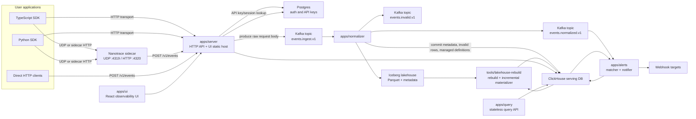
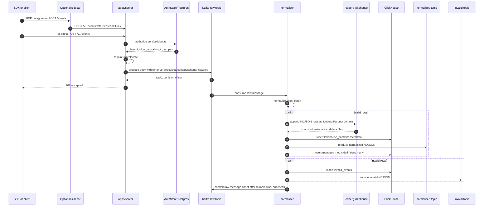
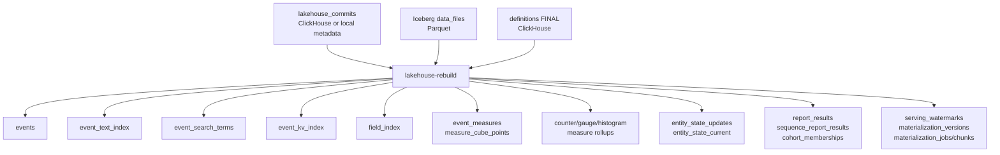
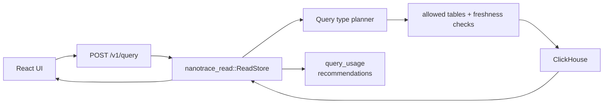
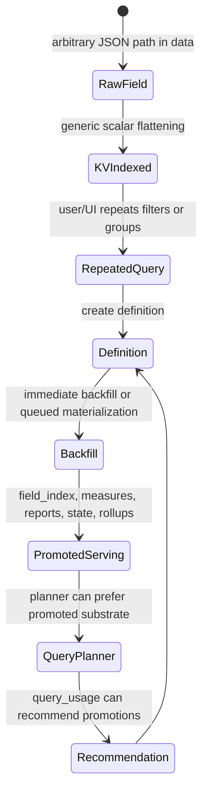
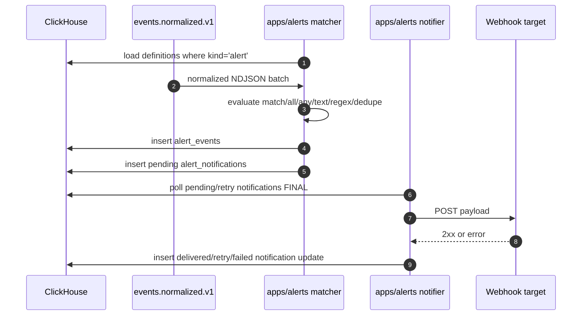
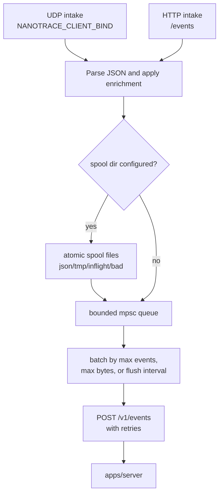
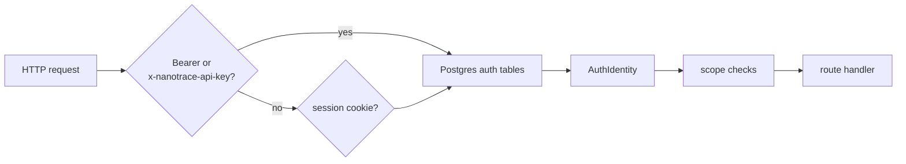
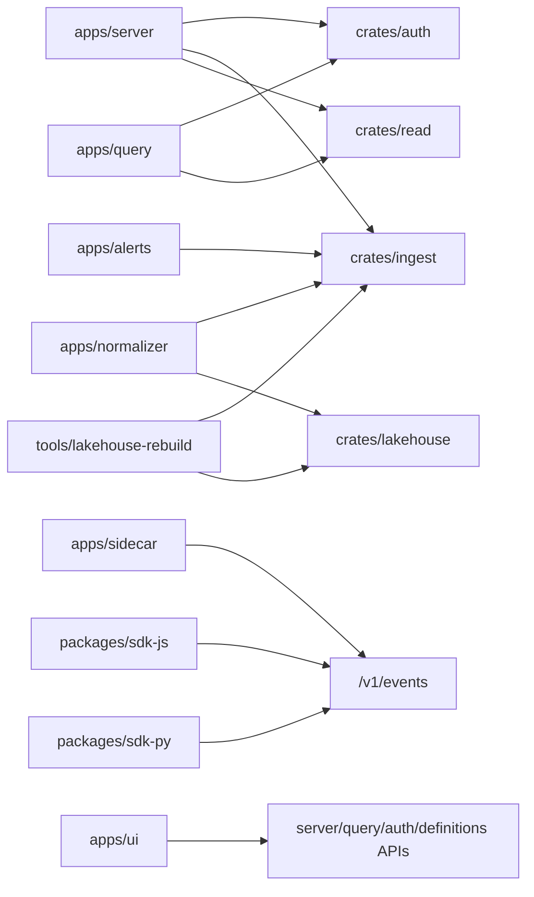
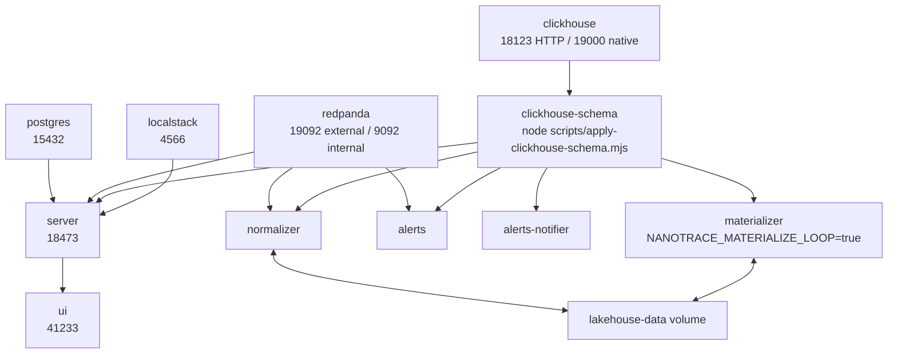

# Nanotrace Engineering Spec

Status: codebase research draft

Last inspected: 2026-06-06

This document describes the implemented Nanotrace system as it appears in this
repository. It is intended as an engineering map for future changes, not as a
marketing overview.

Primary source files inspected:

- `README.md`
- `docker-compose.dev.yml`
- `apps/server/src/{main.rs,http.rs,config.rs,openapi.rs,definitions.rs,materializations.rs}`
- `apps/normalizer/src/main.rs`
- `apps/alerts/src/main.rs`
- `apps/query/src/{main.rs,read.rs}`
- `apps/sidecar/src/main.rs`
- `crates/{auth,ingest,lakehouse,read}/src/lib.rs`
- `tools/lakehouse-rebuild/src/main.rs`
- `deploy/clickhouse/schema.sql`
- `packages/sdk-js/src/*`
- `packages/sdk-py/src/nanotrace/*`
- `apps/ui/src/routes/*`

## Executive Summary

Nanotrace is a raw-first event analytics and observability system. The core
contract is simple: SDKs and clients emit event envelopes with `event_id`,
`timestamp`, optional `observed_timestamp`, and arbitrary JSON `data`. The
server accepts batches, authenticates them, and writes the raw body to Kafka.
The normalizer consumes Kafka, validates and tenant-stamps events, commits valid
events to an Iceberg lakehouse, records invalid rows and commit metadata in
ClickHouse, and emits normalized/invalid Kafka topics.

Serving is built from lakehouse commits. The `nanotrace-lakehouse-rebuild`
binary reads committed Iceberg data files and populates ClickHouse serving
tables: raw events, text/search/KV indexes, promoted field indexes, measures,
rollups, entity state, report definitions, sequences, cohorts, watermarks, and
materialization metadata. Query APIs are served from ClickHouse. Alerts consume
the normalized Kafka topic directly for hot matching and write alert event and
notification state into ClickHouse.

The current public user surface is:

- HTTP ingest and query APIs on `apps/server`.
- A smaller standalone query service in `apps/query`.
- TypeScript and Python instrumentation SDKs with in-process batching.
- An optional local sidecar accepting UDP or HTTP and forwarding batches to the
  ingest server.
- A React UI for event exploration, schema/definition promotion, auth, and API
  key management.

## System Context



## Systems Touched

### Application Services

| System | Path | Responsibility |
| --- | --- | --- |
| Ingest/read/API server | `apps/server` | Main Axum service. Hosts `/v1/events`, `/v1/query`, definitions, backfills, auth, API keys, OpenAPI, health, and optional UI static assets. |
| Normalizer | `apps/normalizer` | Kafka consumer for raw ingest. Validates events, writes valid events to Iceberg, invalid rows and lakehouse commit metadata to ClickHouse, emits normalized/invalid topics, inserts managed metric definitions. |
| Query service | `apps/query` | Smaller Axum service exposing `/v1/query`, `/v1/events/{event_id}`, health, ready. Reuses `nanotrace_read`. |
| Alerts worker | `apps/alerts` | Consumes normalized Kafka, loads alert definitions from ClickHouse, evaluates matchers, inserts alert events and notification rows, optionally runs webhook notifier loop. |
| Sidecar | `apps/sidecar` | Local UDP/HTTP intake, optional disk spool, bounded batching, retrying forwarder to `/v1/events`. |
| UI | `apps/ui` | React app for event exploration, search, schema promotion, backfill jobs, auth, and API keys. |

### Shared Crates

| Crate | Path | Responsibility |
| --- | --- | --- |
| `nanotrace_ingest` | `crates/ingest` | Kafka producer/consumer helpers, raw batch headers, JSON batch normalization, text/search/KV index extraction, managed metric definition discovery. |
| `nanotrace_lakehouse` | `crates/lakehouse` | Iceberg table creation, event NDJSON to Parquet/Arrow, append commits, local catalog pointer, source-batch dedupe, native local compaction. |
| `nanotrace_read` | `crates/read` | Query API model, query planning and SQL generation, ClickHouse execution, tenant scoping, freshness/watermark checks, query usage recording and recommendations. |
| `nanotrace_auth` | `crates/auth` | Postgres-backed sessions, magic links, organizations, API keys, scopes, auth identity. |

### Data Stores

| Store | Tables/topics | Role |
| --- | --- | --- |
| Kafka/Redpanda | `events.ingest.v1`, `events.normalized.v1`, `events.invalid.v1` | Durable async handoff and replay boundary. |
| Iceberg lakehouse | namespace `nanotrace`, table `events` by default | Durable accepted event record. Normalizer writes here before committing raw Kafka offset. |
| ClickHouse | `observatory.*` | Interactive serving tables, invalid rows, definitions, materialized read models, alert state, query usage, watermarks. |
| Postgres | `nanotrace_*` auth tables | Browser auth and API key metadata. |

### Deployment/Operations

| System | Path | Responsibility |
| --- | --- | --- |
| Local compose | `docker-compose.dev.yml` | Redpanda, Postgres, ClickHouse, Localstack, schema loader, server, normalizer, alerts, notifier, materializer, UI. |
| ClickHouse schema | `deploy/clickhouse/schema.sql` | Full serving schema and materialized views. |
| Pulumi | `deploy/pulumi/nanotrace` and `scripts/pulumi-nanotrace.mjs` | AWS/ECR/S3/RDS/KMS/compute deployment path. |
| Load/test tooling | `tools/loadtest`, `tests/integration/kafka-e2e.mjs`, scripts | Load generation, Kafka E2E, schema application, lakehouse rebuild/materialization operations. |

## Event Contract

The normalizer accepts either one event object or a non-empty array of event
objects.

Minimum raw event envelope:

```json
{
  "event_id": "evt_123",
  "timestamp": "2026-06-06T12:00:00.000Z",
  "observed_timestamp": "2026-06-06T12:00:00.000Z",
  "data": {
    "event_type": "span",
    "name": "GET /v1/query"
  }
}
```

Validation rules implemented in `crates/ingest/src/lib.rs`:

- The body must parse as JSON.
- A top-level array must contain at least one event.
- Each event must be a JSON object.
- `event_id` must be a non-empty string.
- `timestamp` must be a non-empty string.
- `data` must be a JSON object.
- The serialized normalized row must be no larger than `MAX_EVENT_BYTES`.

Normalization adds:

- Top-level `tenant_id`, `event_id`, `timestamp`, `observed_timestamp`,
  `source_file`, `source_offset`, `source_length`, and `data`.
- `data.tenant_id` and `data.organization_id`, stamped from auth/Kafka headers.
- `source_file` as `kafka://<topic>/<partition>/<offset>`.
- `source_length` recomputed until the serialized NDJSON row length is stable.

Signal classification appears in both lakehouse/ClickHouse derived fields and
schema materialized expressions:

- `span`, `span_start`, `span_end` -> `trace`
- `metric` -> `metric`
- `log` -> `log`
- `analytics`, `track`, `page`, `screen`, `identify`, `group`, `alias` -> `analytics`
- otherwise `other`

## Detailed Flow: Ingest to Lakehouse



Pseudocode:

```text
post /v1/events:
  identity = authorize_headers(headers)
  require_scope(identity, "ingest:write")
  body = read_request_body(max_request_bytes)
  produced = raw_ingest.produce_raw_batch(
    tenant_id = identity.tenant_id,
    organization_id = identity.organization_id,
    content_type = request.content_type || "application/json",
    body = body
  )
  return 202 { accepted: true, mode: "kafka", topic, partition, offset }

RawBatchProducer.produce_raw_batch:
  received_at = now()
  key = tenant_id + hash(first_4096_bytes(body))
  headers = {
    nanotrace-tenant-id,
    nanotrace-organization-id,
    nanotrace-received-at,
    content-type,
    nanotrace-schema-version = "1"
  }
  produce Kafka record to events.ingest.v1
```

```text
normalizer loop:
  subscribe(events.ingest.v1)
  for message in consumer:
    tenant_id = required message header nanotrace-tenant-id
    organization_id = header nanotrace-organization-id or tenant_id
    received_at = header nanotrace-received-at or now()
    source_file = "kafka://topic/partition/offset"
    token_prefix = "normalizer:topic:partition:offset"

    batch = normalize_json_batch(
      payload,
      tenant_id,
      organization_id,
      source_file,
      received_at,
      max_event_bytes
    )

    if batch.normalized not empty:
      commit = commit_lakehouse(batch.normalized, token_prefix)
      insert lakehouse_commits row with dedupe token

    if batch.invalid not empty:
      insert invalid_events rows with dedupe token

    if configured failure injection and ClickHouse inserted:
      fail before emitting topics/committing Kafka offset

    if batch.normalized not empty:
      produce events.normalized.v1

    if batch.invalid not empty:
      produce events.invalid.v1

    ensure managed definitions in ClickHouse
    commit raw Kafka offset
```

Important invariants:

- The HTTP server does not write raw events directly to ClickHouse or Iceberg.
- The raw Kafka offset is committed only after the normalizer's durable work
  succeeds.
- Iceberg append uses `nanotrace.source-batch-id` and can return a deduplicated
  existing commit for the same source batch.
- ClickHouse inserts use `insert_deduplicate=1`; many inserts also set explicit
  `insert_deduplication_token` values.
- Invalid events are kept as rows in `invalid_events` with `tenant_id`,
  `observed_at`, `reason`, and raw body.

## Detailed Flow: Serving Materialization



Pseudocode:

```text
lakehouse-rebuild main:
  cfg = Config.from_env()

  if NANOTRACE_LAKEHOUSE_MAINTENANCE:
    audit/compact lakehouse
    return

  if NANOTRACE_LAKEHOUSE_QUERY:
    query lakehouse directly
    return

  if NANOTRACE_MATERIALIZE_LOOP:
    if NANOTRACE_MATERIALIZATION_QUEUE_EXECUTOR:
      run queued materialization loop
    else:
      run incremental materializer loop
    return

  commits = read_commit_records(local or ClickHouse)
  definitions = active_definitions() if rebuild_derived

  if incremental_materialize:
    watermarks = derived_watermark_sequences()
    for commit in commits:
      targets = materialize_targets_for_commit(commit.sequence_number, watermarks)
      if targets.any:
        read commit data files
        materialize_rows(rows, definitions, targets)
        publish incremental materialization metadata and watermarks
    return

  optionally guard against non-empty target tables
  optionally truncate events

  for commit in commits:
    for data_file in commit.data_files:
      rows = read_event_rows(data_file)
      if rebuild_raw:
        insert events rows
      if rebuild_derived:
        materialize_rows(rows, definitions, all derived targets)
    insert rebuild metadata/watermarks
```

```text
materialize_rows:
  for each event row:
    if target event_text_index:
      append bounded text document rows
    if target event_search_terms:
      append token rows with path and weight
    if target event_kv_index:
      flatten scalar JSON paths, including array-object scope metadata
    if target field_index:
      evaluate active field definitions
    if target event_measures:
      evaluate active measure definitions
    if target measure_cube_points:
      evaluate active measure cube definitions
    if target metric rollups:
      evaluate counter/gauge/histogram rollup definitions
    if target entity state:
      evaluate state definitions

  across batch:
    evaluate report definitions
    evaluate trace report definitions
    evaluate cohort definitions
    evaluate retention reports using current/new cohort memberships
    evaluate sequence reports

  insert each non-empty row group into ClickHouse with a stable dedupe token
  return row counts and materialized output versions
```

## Detailed Flow: Query and UI Reads



`/v1/query` dispatches on a top-level `type` field:

| Type | Main request struct | Serving substrate |
| --- | --- | --- |
| `events` | `EventsQueryRequest` | `events`, `event_density_1s`, `field_rollups`, `field_values`, `event_kv_index`, `event_text_index`, `event_search_terms`, `field_index` where safe. |
| `search` | `SearchQueryRequest` | `event_search_terms` for token/prefix/fuzzy modes, `event_text_index` for phrase/snippets. |
| `measure` | `MeasureQueryRequest` | `measure_cube_rollups`. |
| `funnel` | `FunnelQueryRequest` | `sequence_report_results`. |
| `cohort` | `CohortQueryRequest` | `cohort_memberships`. |
| `report` | `ReportQueryRequest` | `report_results`. |
| `state` | `StateQueryRequest` | `entity_state_current` and state-specific filters. |
| `alerts` | `AlertQueryRequest` | `alert_events` or `alert_notifications`. |

Events view modes:

- `group_options`
- `groups`
- `latest`
- `summary`
- `events`
- `density`
- `flamegraph`
- `event`

Event filter operators:

- `eq`
- `exists`
- `contains`
- `gt`
- `gte`
- `lt`
- `lte`
- `in`

Search modes:

- `token`
- `prefix`
- `fuzzy`
- `phrase`

Pseudocode:

```text
POST /v1/query:
  identity = authorize_scope("query:read")
  request = deserialize QueryApiRequest by top-level type
  result = ReadStore.api_query(request, identity.tenant_id)
  return result

ReadStore.api_query:
  switch request.type:
    events: events_query()
    search: search_query()
    measure: measures_query()
    funnel: funnels_query()
    cohort: cohorts_query()
    report: reports_query()
    state: states_query()
    alerts: alerts_query()

query execution:
  generate ClickHouse SQL and parameters
  apply tenant scope from the authenticated service identity
  validate/limit allowed tables
  check serving freshness unless allow_stale_serving is true
  execute ClickHouse JSON query with max row/time/byte settings
  record query_usage with query shape, source tables, plan kind, metrics
  attach nanotrace planning/freshness/recommendation metadata
```

The UI calls:

- `POST /v1/query` for all event/search/report serving views.
- `GET /v1/events/{event_id}` for a single raw event payload.
- `GET/POST /v1/definitions`, `GET/DELETE /v1/definitions/{definition_id}`, and
  `POST /v1/definitions/{definition_id}/backfill`.
- `POST /v1/definitions/{definition_id}/backfills`,
  `GET /v1/backfills`, and `GET /v1/backfills/{job_id}` for report,
  sequence, and cohort definition backfills.
- `GET /auth/me`, `GET /auth/providers`, `GET/POST /auth/login`,
  `GET /auth/callback`, `GET /auth/google`,
  `GET /auth/google/callback`, `POST /auth/logout`.
- `GET/POST/DELETE /v1/api-keys`.

## Detailed Flow: Definitions and Promotion



Definition storage:

- Definition rows live in ClickHouse `definitions`.
- Active definitions are read with `FINAL`, `enabled = 1`, and
  `deleted_at IS NULL`.
- Supported kinds observed in server/read/materializer paths include `field`,
  `measure`, `rollup`, `metric_rollup`, `state`, `search`, `report`,
  `sequence`, `cohort`, and `alert`.
- Server-created definitions get ids like `def_<slug>_<millis>`.
- Definition versions are timestamp-derived milliseconds.
- Definition mutation is append/versioned: create inserts a new active
  definition row, delete inserts a disabled/deleted version, and there is no
  in-place update endpoint.
- SDK/default metric definitions are seeded automatically by the server at
  startup for known organizations and after account API organization creation
  when ClickHouse is configured. With auth disabled, no organization-scoped
  defaults are seeded.
- The normalizer can insert managed metric rollup definitions discovered from
  metric events.

Backfill paths:

- Synchronous definition backfill in `apps/server/src/definitions.rs` supports
  field, measure/rollup, and state definition kinds.
- Backfill jobs in `apps/server/src/materializations.rs` split a requested
  source time range into chunks and insert internal `materialization_jobs` and
  `materialization_chunks`.
- `tools/lakehouse-rebuild` can run as queue executor and publish completed
  chunks, versions, watermarks, and updated job state.

## Detailed Flow: Alerts



Alert match capabilities:

- `all` and `any` matcher groups.
- Operators: `exists`, `not_exists`, `eq`, `ne`/`neq`, `contains`, `gt`,
  `gte`, `lt`, `lte`, `regex`, `is_number`, `is_error`.
- Optional full-event text contains match.
- Optional regex over alert haystack.
- Severity: `info`, `warning`, or `critical`.
- Dedupe by explicit `dedupe_key` path or event id, bucketed by
  `dedupe_seconds`.
- Notification channel currently implemented: `webhook`.

## Detailed Flow: Sidecar



Sidecar behavior:

- UDP intake accepts single event or array payloads.
- HTTP intake exposes `/events` and `/healthz`.
- Optional disk spool uses atomic file creation, `.inflight` claim files, and
  `.bad` quarantine for unreadable files.
- Batching flushes on configured event count, byte limit, or timer.
- Successful sends delete inflight spool files.
- Failed sends restore inflight files where applicable, retry, then drop/log
  after retry exhaustion.

## Auth and Tenancy



Auth tables are created and upgraded by versioned SQL migrations in
`crates/auth/migrations`:

- `nanotrace_organizations`
- `nanotrace_auth_users`
- `nanotrace_organization_members`
- `nanotrace_auth_sessions`
- `nanotrace_magic_links`
- `nanotrace_oauth_states`
- `nanotrace_organization_invitations`
- `nanotrace_api_keys`
- `nanotrace_account_audit_events`

API key identities are loaded into an in-process `AuthStore` cache on startup.
The cache is refreshed by a background Tokio task every
`NANOTRACE_API_KEY_CACHE_REFRESH_SECS` seconds, defaulting to 5. Request-path
API key validation reads this map in memory after the initial load; Postgres
remains the source of truth for sessions, magic links, organizations, and API
key mutations.

Archived organizations are excluded from session membership resolution and API
key cache loading. Archiving an organization revokes its API keys, revokes
pending invitations, and clears active sessions for that organization. Account
lifecycle mutations also write durable rows to
`nanotrace_account_audit_events`.

See [tenant-route-inventory.md](tenant-route-inventory.md) for the public route
tenant source, role/scope, and coverage inventory.

Default scopes:

| Role | Scopes |
| --- | --- |
| `admin` | `ingest:write`, `query:read`, `definitions:write`, `api_keys:write`, `facets:write` |
| `service` | `ingest:write`, `query:read` |
| `viewer` | `query:read` |

Tenancy:

- `tenant_id` currently maps to organization id in auth identities.
- The server stamps raw Kafka messages with tenant and organization headers.
- The normalizer stamps both fields into `data`.
- Read paths tenant-scope normal user queries.
- There is no public admin SQL query endpoint. User-facing reads go through the
  typed `/v1/query` API.

## Core HTTP API Surface

The main server publishes generated OpenAPI at `/openapi.json`.

### Events

| Method | Path | Scope | Notes |
| --- | --- | --- | --- |
| `POST` | `/v1/events` | `ingest:write` | Accepts one event object or an event array. Produces raw body to Kafka. Returns `202` with topic/partition/offset. |
| `GET` | `/v1/events/{event_id}` | `query:read` | Fetches one raw event JSON by id and tenant. |

### Query

| Method | Path | Scope | Notes |
| --- | --- | --- | --- |
| `POST` | `/v1/query` | `query:read` | Structured query endpoint keyed by top-level `type`. |
| `GET` | `/v1/query/recommendations?limit=N` | `query:read` | Recent query usage recommendations, clamped to 1..100. |
Structured event query shape:

```json
{
  "type": "events",
  "view": "events",
  "filter": {
    "createdAfter": "2026-06-06T00:00:00.000Z",
    "createdBefore": "2026-06-06T01:00:00.000Z",
    "facets": [
      { "path": "service", "operator": "eq", "value": "api" }
    ],
    "text": "timeout"
  },
  "limit": 100,
  "sort": { "direction": "desc" }
}
```

Search query shape:

```json
{
  "type": "search",
  "query": "checkout timeout",
  "mode": "token",
  "requireAllTerms": true,
  "includeSnippets": true,
  "from": "2026-06-06T00:00:00.000Z",
  "to": "2026-06-06T01:00:00.000Z",
  "limit": 50
}
```

### Definitions

| Method | Path | Scope | Notes |
| --- | --- | --- | --- |
| `GET` | `/v1/definitions` | `query:read` | Lists active definitions plus latest synchronous backfill status. |
| `GET` | `/v1/definitions/{definition_id}` | `query:read` | Fetches one active definition plus latest synchronous backfill status. |
| `POST` | `/v1/definitions` | admin + `definitions:write` | Creates a definition, optionally with immediate backfill. |
| `DELETE` | `/v1/definitions/{definition_id}` | admin + `definitions:write` | Soft-deletes by inserting a disabled/deleted version. |
| `POST` | `/v1/definitions/{definition_id}/backfill` | admin + `definitions:write` | Runs synchronous backfill for field, measure/rollup, and state definitions. |

### Backfills

| Method | Path | Scope | Notes |
| --- | --- | --- | --- |
| `GET` | `/v1/backfills` | `query:read` | Lists queued backfill jobs. |
| `POST` | `/v1/definitions/{definition_id}/backfills` | admin + `definitions:write` | Creates a chunked historical backfill for a report, sequence, or cohort definition. |
| `GET` | `/v1/backfills/{job_id}` | `query:read` | Fetches a backfill job plus chunks. |

### Auth and API Keys

| Method | Path | Notes |
| --- | --- | --- |
| `GET` | `/auth/providers` | Returns configured browser login providers. |
| `GET` | `/auth/login` | Login form. |
| `POST` | `/auth/login` | Starts magic-link login. |
| `GET` | `/auth/callback` | Completes magic-link login and sets session cookie. |
| `GET` | `/auth/google` | Starts Google OAuth when configured. |
| `GET` | `/auth/google/callback` | Completes Google OAuth and sets session cookie. |
| `POST` | `/auth/logout` | Deletes session and expires cookie. |
| `GET` | `/auth/me` | Returns current identity. |
| `GET` | `/v1/auth/me` | API identity endpoint for the current session or API key. |
| `GET` | `/v1/api-keys` | Lists API keys. |
| `POST` | `/v1/api-keys` | Creates API key. |
| `DELETE` | `/v1/api-keys/{id}` | Revokes API key. |

### Health and Metadata

| Method | Path | Notes |
| --- | --- | --- |
| `GET` | `/healthz`, `/v1/healthz` | Liveness. |
| `GET` | `/readyz`, `/v1/readyz` | Readiness. |
| `GET` | `/metrics` | Ops-only Prometheus text metrics for the server process; not part of OpenAPI or SDK surface. |
| `GET` | `/openapi.json` | Generated OpenAPI spec. |

## SDK Surface

### TypeScript SDK

Exports from `packages/sdk-js/src/index.ts`:

- Client creation: `createNanotrace`, `Nanotrace`.
- Context: `currentContext`, `withContext`.
- Transports: `httpTransport`, `sidecarHttpTransport`, `udpTransport`.
- Client-side batching: direct HTTP and sidecar HTTP transports post arrays to
  the supported ingest paths by default; custom transports without batch support
  continue to receive individual events.
- Types: `CommonFields`, `EventEnvelope`, `SpanHandle`, `SpanOptions`,
  `Transport`, and domain event types.

Primary client methods:

| Method | Purpose |
| --- | --- |
| `emit(event)` | Emit raw event envelope. Adds id/timestamp if missing and merges base/current context into `data`. |
| `flush()` | Waits for pending sends, throws `AggregateError` on transport failures. |
| `event(name, data)` | Generic analytics event. |
| `log/debug/info/warn/error/captureException` | Log and exception events. |
| `span/startSpan` | Starts span handle with `set`, `event`, and `end`. |
| `recordSpan` | Emits a complete span. |
| `httpServerRequest`, `httpClientRequest` | HTTP span helpers. |
| `dbQuery`, `rpcCall` | DB/RPC span helpers. |
| `messagePublish`, `messageConsume` | Messaging span helpers. |
| `counter`, `gauge`, `histogram`, `measure`, `timing` | Metric helpers. |
| `track`, `identify`, `group`, `alias`, `page`, `screen` | Product analytics helpers. |
| `revenue`, `experimentViewed`, `featureFlagEvaluated` | Higher-level product events. |

TypeScript usage:

```ts
import { createNanotrace, httpTransport } from '@nanotrace/sdk'

const nt = createNanotrace({
  service: 'api',
  environment: 'prod',
  transport: httpTransport({
    url: process.env.NANOTRACE_URL!,
    key: process.env.NANOTRACE_API_KEY!
  })
})

const span = nt.startSpan('checkout')
span.set('account_id', 'acct_123')
span.end({ is_error: 0 })
await nt.flush()
```

### Python SDK

Exports from `packages/sdk-py/src/nanotrace/__init__.py`:

- Sync client: `Nanotrace`, `Span`, `create_nanotrace`.
- Async client: `AsyncNanotrace`, `AsyncSpan`, `create_async_nanotrace`.
- Context: `current_context`, `trace_context`.
- Sync transports: `HttpTransport`, `SidecarHttpTransport`, `UdpTransport`,
  helper constructors.
- Async transports: `AsyncHttpTransport`, `AsyncSidecarHttpTransport`,
  `AsyncUdpTransport`, helper constructors.

The Python client mirrors the TypeScript verbs using snake_case method names:

- `emit`
- `flush`
- `event`, `log`, `debug`, `info`, `warn`, `error`, `capture_exception`
- `span`, `start_span`, `record_span`
- `http_server_request`, `http_client_request`
- `db_query`, `rpc_call`
- `message_publish`, `message_consume`
- `counter`, `gauge`, `histogram`, `measure`, `timing`
- `track`, `identify`, `group`, `alias`, `page`, `screen`
- `revenue`, `experiment_viewed`, `feature_flag_evaluated`

Python usage:

```py
from nanotrace import create_nanotrace, http_transport

nt = create_nanotrace(
    transport=http_transport(
        url="https://nanotrace.example.com",
        key="ntak_..."
    ),
    service="api",
    environment="prod",
)

with nt.start_span("checkout") as span:
    span.set("account_id", "acct_123")

nt.flush()
```

## ClickHouse Serving Tables

The ClickHouse schema in `deploy/clickhouse/schema.sql` creates these key
tables:

| Category | Tables |
| --- | --- |
| Raw and invalid events | `events`, `invalid_events` |
| Alerting | `alert_events`, `alert_notifications` |
| Search indexes | `event_text_index`, `event_search_terms` |
| Always-on rollups/indexes | `event_density_1s`, `field_rollups`, `field_values` |
| Promotion definitions and indexes | `definitions`, `field_index`, `event_kv_index` |
| Measures and metric rollups | `event_measures`, `measure_rollups`, `measure_cube_points`, `measure_cube_rollups`, `counter_rollups`, `gauge_rollups`, `histogram_rollups` |
| Entity state | `entity_state_updates`, `entity_state_current` |
| Reports/cohorts/sequences | `cohort_memberships`, `report_results`, `sequence_report_results` |
| Operations and recommendations | `definition_stats`, `query_usage`, `pipeline_metrics` |
| Materialization metadata | `materialization_jobs`, `materialization_chunks`, `materialization_versions`, `materialization_watermarks` |
| Lakehouse and serving watermarks | `lakehouse_commits`, `serving_watermarks` |

Materialized views:

- `mv_event_density_1s`
- `mv_field_rollups`
- `mv_field_values`
- `mv_measure_rollups`
- `mv_measure_cube_rollups`

## Repository Dependency Graph



## Local Development Topology



Local scripts from `package.json`:

- `npm run dev:up`
- `npm run dev:up:detached`
- `npm run dev:seed-auth`
- `npm run dev:down`
- `npm run dev:reset`
- `npm run dev:schema:reset`
- `npm run lakehouse:rebuild:local`
- `npm run lakehouse:materializer:local`
- `npm run integration:kafka`
- `npm run loadtest:local`

## Open Questions and Risk Areas

These are not necessarily bugs. They are areas future engineering work should
keep explicit:

- The README says the materializer loads raw serving rows from lakehouse
  commits, but `MaterializeTargets::all()` defaults `events: false`; raw event
  backfill depends on `rebuild_raw` or target selection. Keep raw serving
  rebuild/incremental semantics clear in operator docs.
- Some catalogs are split: service identities live in Postgres, while
  definitions and materialization metadata live in ClickHouse. This is workable
  but needs clear ownership rules as definition-backed outputs grow.
- The sidecar can drop batches after retry exhaustion when not using spool or
  when restore fails. That behavior should stay visible in operational docs.
- Alert dedupe is in-memory in the matcher process plus ClickHouse dedupe on
  insert. Horizontal scaling changes should revisit dedupe guarantees.
- Query freshness checks and `allow_stale_serving` are central to planner
  correctness. Any new serving table should define its watermark behavior before
  becoming queryable.
- SDK clients batch events in process by count, byte size, or flush interval.
  Direct HTTP and sidecar HTTP transports post JSON arrays; UDP keeps
  single-event datagrams to avoid oversized packet loss.

## Change Checklist for Future Work

When touching this system, verify the relevant layer:

- Ingest changes: update SDK event shape, `normalize_json_batch`, ClickHouse
  `events` JSON subcolumns, lakehouse row parsing, and OpenAPI examples.
- New query feature: add request type/schema, planner SQL, allowed-table and
  freshness behavior, UI fetch path, and query usage metadata.
- New promoted output: add definition parser, materializer extraction rows,
  ClickHouse table/schema, watermark/version publishing, query API reader, and
  UI controls.
- New alert capability: add definition config parser, matcher tests, notifier
  payload/update behavior, and schema docs.
- New SDK helper: implement in both TypeScript and Python, normalize field names
  consistently, add transport/flush behavior tests.
